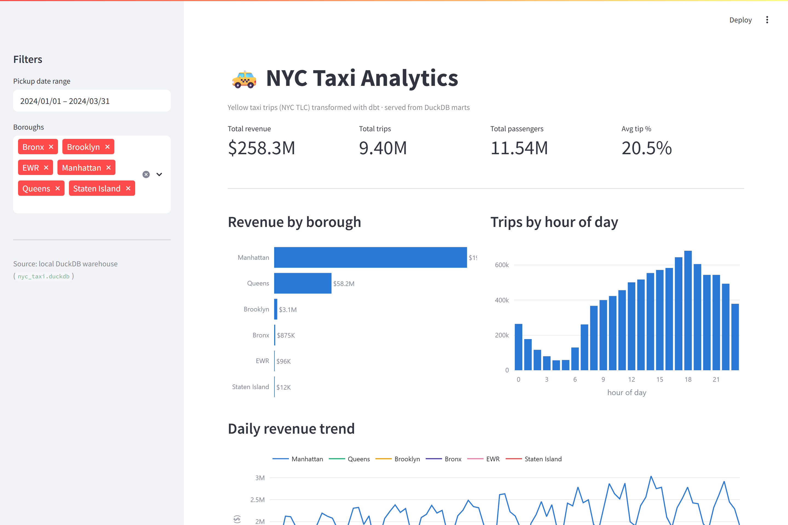

<div align="center">

# 🚕 NYC Taxi Analytics

### An end-to-end analytics engineering pipeline on **9.4 million** NYC taxi trips

Raw TLC trip data → tested **dbt** marts → an interactive **Streamlit** dashboard.
Runs free on local **DuckDB**, deploys to the cloud, and scales to **BigQuery**.

<br/>

[](https://nyctaxidbt-as6niaviukjr4sinhjdpyz.streamlit.app/)

<br/>

[](https://github.com/jumma786/nyc_taxi_dbt/actions/workflows/ci.yml)


**Author:** Jumma Mohammad Teli · [GitHub](https://github.com/jumma786) · [LinkedIn](https://linkedin.com/in/jumma-mohammad)

</div>

---

## 📋 Table of Contents

- [Overview](#-overview)
- [Live Demo & Key Insights](#-live-demo--key-insights)
- [Tech Stack](#-tech-stack)
- [Architecture](#-architecture)
- [Data Model](#-data-model)
- [Data Quality & Testing](#-data-quality--testing)
- [Quickstart](#-quickstart)
- [The Dashboard](#-the-dashboard)
- [Deploy Your Own](#-deploy-your-own)
- [Orchestration (Airflow)](#-orchestration-airflow)
- [dev → prod: DuckDB to BigQuery](#-dev--prod-duckdb-to-bigquery)
- [Project Structure](#-project-structure)

---

## 🎯 Overview

This project takes raw **NYC Taxi & Limousine Commission** yellow-taxi trip records
and turns them into clean, tested, analytics-ready data models using modern
analytics-engineering practices — then puts a dashboard on top so the insights are
actually usable.

It is deliberately built to demonstrate the **full lifecycle** an analytics/data
engineer owns:

| | |
|---|---|
| 🧱 **Layered modelling** | dbt `staging → intermediate → marts`, materialized by cost |
| ⭐ **Dimensional design** | a clean star schema (`fct_trips` + `dim_zone`) |
| ♻️ **Incremental loads** | `fct_trips` processes only new trips on each run |
| ✅ **Data quality** | generic + custom dbt tests that caught real dirty data |
| 🔬 **Reusable logic** | a Jinja macro for consistent duration math |
| 🗓️ **Orchestration** | an idempotent Airflow ELT DAG with retries & DQ gates |
| 🔁 **CI** | GitHub Actions runs a full `dbt build` on every push |
| 📊 **BI layer** | a deployable Streamlit dashboard — no database required |
| ☁️ **Cloud-portable** | one codebase, two warehouses (DuckDB ↔ BigQuery) |

---

## 🚀 Live Demo & Key Insights

**▶ [Open the live dashboard →](https://nyctaxidbt-as6niaviukjr4sinhjdpyz.streamlit.app/)**

[](https://nyctaxidbt-as6niaviukjr4sinhjdpyz.streamlit.app/)

What the data shows for **Q1 2024** (~9.4M trips):

| Metric | Value |
|---|---:|
| 💵 Total revenue | **$258.3M** |
| 🚕 Total trips | **9.40M** |
| 👥 Total passengers | **11.54M** |
| 💳 Average tip | **20.5%** |
| 🏙️ Top borough | **Manhattan** (~$196M, ~76% of revenue) |
| ⏰ Peak pickup hour | **6 PM** |

---

## 🛠 Tech Stack

| Layer | Technology | Role |
|---|---|---|
| **Transformation** | dbt (dbt-duckdb / dbt-bigquery) | Version-controlled SQL, tests, lineage, incremental models |
| **Warehouse — dev** | DuckDB | Free embedded engine; reads Parquet directly, zero setup |
| **Warehouse — prod** | Google BigQuery | Cloud scale; env-var driven, no secrets in repo |
| **Ingestion (prod)** | dlt | Lands Parquet → GCS → BigQuery |
| **Orchestration** | Apache Airflow | Scheduled, idempotent extract → load → build → verify |
| **CI/CD** | GitHub Actions | `dbt build` (all tests) on every push & PR |
| **BI / Serving** | Streamlit + Plotly | Interactive dashboard, cloud-deployable |
| **Language** | Python 3.11 | Ingestion scripts, loader, dashboard |

---

## 🏗 Architecture

```
                          NYC TLC Open Data (public Parquet + CSV)
                                        │
                        extract  │  scripts/download_data.py  ·  Airflow DAG
                                        ▼
        ┌───────────────────────── RAW LANDING ─────────────────────────┐
        │   dev  →  local Parquet files, read in place by DuckDB         │
        │   prod →  GCS bucket → BigQuery table (dlt loader)             │
        └───────────────────────────────┬───────────────────────────────┘
                                         │  transform  │  dbt
                                         ▼
     ┌───────────────┐     ┌───────────────────┐     ┌────────────────────────┐
     │   STAGING     │ ──► │   INTERMEDIATE    │ ──► │         MARTS          │
     │   (views)     │     │     (views)       │     │       (tables)         │
     │  stg_trips    │     │ int_trips_        │     │  dim_zone              │
     │  stg_zones    │     │      enriched     │     │  fct_trips (incr.)     │
     │  + DQ gate    │     │  + zone joins     │     │  agg_daily_revenue     │
     └───────────────┘     └───────────────────┘     └───────────┬────────────┘
                                                                  │  serve
                                                                  ▼
                                                     ┌────────────────────────┐
                                                     │   Streamlit Dashboard  │
                                                     │  local: DuckDB (attach)│
                                                     │  cloud: parquet marts  │
                                                     └────────────────────────┘
```

---

## 📐 Data Model

A classic **star schema** — one fact table surrounded by a conformed dimension —
plus a pre-aggregated summary mart for fast BI reads.

```
        ┌──────────────────┐
        │     dim_zone     │   265 NYC taxi zones
        │  location_id (PK)│   borough · zone · service_zone
        │  borough, zone   │
        └────────┬─────────┘
                 │  pickup / dropoff location_id
                 ▼
        ┌──────────────────────────────┐        ┌──────────────────────────┐
        │          fct_trips           │        │    agg_daily_revenue     │
        │  trip_id (surrogate PK)      │  ───►  │  pickup_date × borough   │
        │  pickup/dropoff, fare, tip,  │        │  revenue, trips, avg fare│
        │  distance, duration, tip_pct │        │  avg tip%, avg duration  │
        │  incremental · ~9.4M rows    │        │  (BI-ready rollup)       │
        └──────────────────────────────┘        └──────────────────────────┘
```

- **Surrogate key** — the TLC data has no primary key, so `trip_id` is a hash of
  vendor + timestamps + locations + amount (via `dbt_utils.generate_surrogate_key`).
- **Incremental** — `fct_trips` only processes trips newer than the max already
  loaded (`delete+insert` on `trip_id`), so re-runs are cheap.

---

## ✅ Data Quality & Testing

Testing isn't decoration here — it **caught real bugs**. A full 3-month build runs
**22 dbt nodes**, including **15 tests**:

- **Generic tests** — `unique`, `not_null`, `relationships` (FK to `dim_zone`), and
  `accepted_range` on trip duration.
- **Custom singular test** — `assert_total_amount_reconciles`: every trip's
  `total_amount` must cover `fare + tip + tolls` (within a cent).
- **Staging DQ gate** — drops rows with null/negative/inverted timestamps or amounts.

> **🐛 The bug the tests found.** On a single month, everything passed. On the full
> 9.4M rows, two tests **failed**: 3 corrupt trips whose total was less than the sum
> of their parts, and a duplicate surrogate key (the TLC data ships duplicate rows).
> Both were fixed at the boundary in staging — a reconciliation gate and a dedup —
> and CI now builds all three months so it exercises that path on every push.

```bash
dbt build --profiles-dir .        # 22/22 pass on the full dataset ✔
```

---

## ⚡ Quickstart

Runs free on your laptop — no cloud account needed.

```bash
# 1. Install dbt (DuckDB adapter)
python -m pip install dbt-duckdb

# 2. Download data (3 months of 2024 by default)
python scripts/download_data.py --year 2024 --months 1 2 3

# 3. Install dbt packages
dbt deps --profiles-dir .

# 4. Build & test everything (seeds → models → tests)
dbt build --profiles-dir .

# 5. Explore lineage & docs
dbt docs generate --profiles-dir . && dbt docs serve --profiles-dir .
```

**Incremental demo** — add a month and only new trips are processed:

```bash
python scripts/download_data.py --year 2024 --months 4
dbt run --select fct_trips+ --profiles-dir .
```

---

## 📊 The Dashboard

An interactive **Streamlit** app is the consumption layer over the
`agg_daily_revenue` and `fct_trips` marts:

- **KPI tiles** — total revenue, trips, passengers, average tip %
- **Revenue by borough** · **Trips by hour of day** · **Daily revenue trend**
- **Filters** — pickup date range and borough
- **Accessible by design** — a colorblind-safe categorical palette, each borough
  pinned to a fixed hue (never recolored when filters change)

```bash
pip install -r requirements.txt
# build the marts first (see Quickstart), then:
streamlit run dashboard/app.py        # http://localhost:8501
```

**Two backends, one code path.** The app talks to DuckDB either way:

- **Local** — attaches the full dbt-built warehouse (`nyc_taxi.duckdb`) read-only.
- **Cloud** — with no warehouse present, it reads small pre-aggregated marts
  committed at `dashboard/data/*.parquet` (**~85 KB**), so it deploys with **no
  database and no 160 MB of raw data**.

---

## ☁️ Deploy Your Own

Free on **Streamlit Community Cloud**:

1. Fork / push this repo to GitHub.
2. Go to **[share.streamlit.io](https://share.streamlit.io)** → sign in with GitHub.
3. **Create app** → this repo · branch `main` · **main file** `dashboard/app.py`.
4. **Deploy.** Dependencies install from the root `requirements.txt`; the app reads
   `dashboard/data/*.parquet`. You get a public `https://<app>.streamlit.app` URL.

> The DuckDB path defaults to `nyc_taxi.duckdb`; override with the
> `NYC_TAXI_DUCKDB` environment variable.

---

## 🗓 Orchestration (Airflow)

The `airflow/` directory turns the project into a scheduled ELT pipeline. The
`nyc_taxi_elt` DAG runs monthly in four stages:

```
extract  ──►  load_check  ──►  dbt_build  ──►  freshness_check
download      verify file      models +        assert the mart has
Parquet to    landed & not     tests run       rows for the loaded
raw zone      empty                            month
```

- **Idempotent** — re-running a month skips existing downloads; incremental
  `fct_trips` only processes new pickups.
- **Resilient** — retries on transient failures; `max_active_runs=1` prevents
  concurrent writers clobbering the DuckDB file.
- **Separation of concerns** — ingestion (E/L) is distinct from transformation (dbt's T).

```bash
cd airflow && docker compose up      # UI at http://localhost:8080
# then trigger the nyc_taxi_elt DAG
```

---

## 🌐 dev → prod: DuckDB to BigQuery

The same models run against two warehouses, selected by dbt target:

| | **dev** | **prod** |
|---|---|---|
| Engine | DuckDB (local, free) | BigQuery (cloud) |
| Raw data | Parquet read in place | GCS bucket → BigQuery (dlt loader) |
| Config | zero setup | 100% environment variables — **no secrets in repo** |

The `raw.yellow_tripdata` source is **target-aware**: it resolves to a local
`read_parquet(...)` on dev and to `<project>.<dataset>.yellow_tripdata` on prod
(see `models/staging/_sources.yml`). Full cloud setup: **[`loader/CLOUD_RUNBOOK.md`](loader/CLOUD_RUNBOOK.md)**.

---

## 📁 Project Structure

```
nyc_taxi_dbt/
├── models/
│   ├── staging/        stg_trips, stg_zones · _sources.yml · _staging.yml
│   ├── intermediate/   int_trips_enriched
│   └── marts/          dim_zone · fct_trips (incremental) · agg_daily_revenue
├── macros/             trip_duration_minutes.sql
├── tests/              assert_total_amount_reconciles.sql (custom)
├── seeds/              taxi_zone_lookup.csv
├── scripts/            download_data.py
├── dashboard/          app.py (Streamlit BI)  ·  data/*.parquet (cloud marts)
├── airflow/            dags/nyc_taxi_elt_dag.py · docker-compose.yml
├── loader/             load_to_bq.py (dlt) · CLOUD_RUNBOOK.md
├── .github/workflows/  ci.yml (dbt build on push/PR)
├── dbt_project.yml · profiles.yml · packages.yml
└── requirements.txt    (dashboard deps — used by Streamlit Cloud)
```

---

## 📚 Data Source

**NYC Taxi & Limousine Commission — [Trip Record Data](https://www.nyc.gov/site/tlc/about/tlc-trip-record-data.page)** (public).
Yellow-taxi trips (`yellow_tripdata_YYYY-MM.parquet`, ~3M rows/month) and the taxi
zone lookup (`taxi_zone_lookup.csv`, 265 zones).

---

<div align="center">

**Built by Jumma Mohammad Teli** — [GitHub](https://github.com/jumma786) · [LinkedIn](https://linkedin.com/in/jumma-mohammad)

⭐ If this helped, consider starring the repo.

</div>
